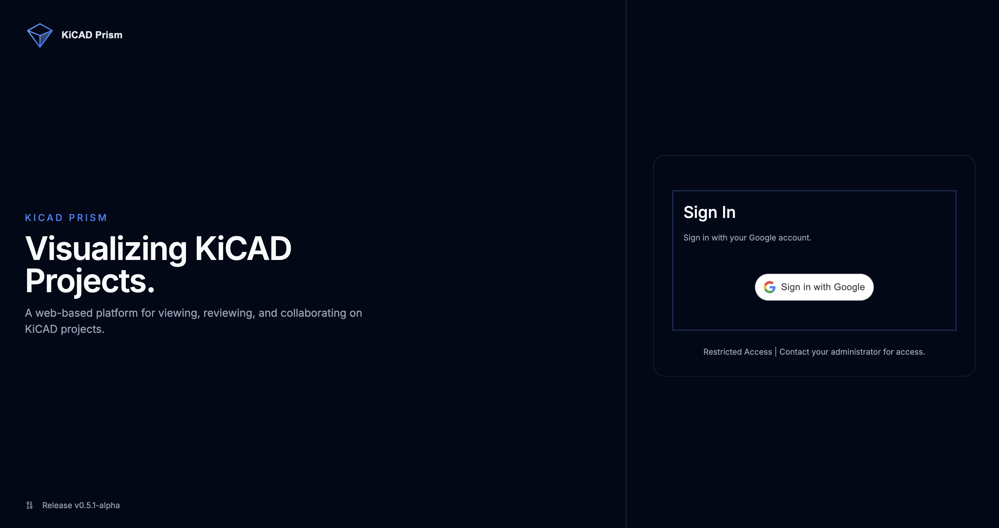

# KiCAD Prism

KiCAD Prism is a web platform for browsing, reviewing, and operating on KiCad repositories from the browser. It combines a FastAPI backend, a React/Vite frontend, repository import/sync flows, RBAC-based access control, comments export helpers, and manufacturing/documentation workflows in one workspace.



## Core Capabilities

### Workspace and Repository Management

- Import standalone KiCad repositories or monorepos that contain multiple boards.
- Sync repositories from their remotes without leaving the UI.
- Organize projects into folders with RBAC-aware visibility.
- Search projects by name, display name, description, and parent repo.

<p align="center">
  
  
</p>

### Project Exploration

- Native schematic and PCB viewing in the browser.
- 3D board viewing and Interactive HTML BOM integration.
- Markdown README and project docs browsing.
- Design outputs and manufacturing outputs browsing and download.
- Project history, releases, and visual diff support.

<p align="center">
  
  
</p>

<p align="center">
  
  
</p>

### Review and Collaboration

- Comments are stored in SQLite for live collaboration.
- `.comments/comments.json` can be exported for repository-based workflows.
- Per-project helper URLs are exposed to configure KiCad REST comment sources.
- Role-based access control separates viewer, designer, and admin permissions.

<p align="center">
  
  
</p>

> Integration into KiCAD natively is currently on an experimental custom build of KiCAD v9.99. For now, users can use this platform for tracking comments

### Workflow Automation

- Trigger KiCad workflow jobs from the UI.
- Generate design, manufacturing, and render outputs.
- Browse generated artifacts from the project detail page.


## Architecture

- Frontend: React, TypeScript, Vite, Tailwind, shadcn/ui
- Backend: FastAPI, GitPython, Pydantic Settings
- Storage:
  - imported repositories under `data/projects`
  - SSH material under `data/ssh`
  - role assignments in `.rbac_roles.json`
  - folder metadata in `.folders.json`
  - comments in SQLite plus optional `.comments/comments.json` export
- Runtime split:
  - Docker frontend serves the production bundle on port `8080`
  - backend API serves on port `8000`

## Quick Start

### Docker

```bash
git clone https://github.com/krishna-swaroop/KiCAD-Prism.git
cd KiCAD-Prism
cp .env.example .env
```

Guest mode:

```env
AUTH_ENABLED=false
```

Google login + RBAC session auth:

```env
AUTH_ENABLED=true
GOOGLE_CLIENT_ID=your-client-id.apps.googleusercontent.com
SESSION_SECRET=replace-with-a-long-random-secret
BOOTSTRAP_ADMIN_USERS_STR=admin@example.com
SESSION_COOKIE_SECURE=false
```

Start the stack:

```bash
docker compose up --build -d
```

Open the UI at [http://127.0.0.1:8080](http://127.0.0.1:8080).

Important:
- `SESSION_SECRET` is required whenever auth is effectively enabled.
- `SESSION_COOKIE_SECURE=true` should be used only behind HTTPS.
- Docker Compose reads the root `.env` automatically.

### Local Development

Backend:

```bash
cd backend
python3 -m venv venv
source venv/bin/activate
pip install -r requirements.txt
uvicorn app.main:app --reload --port 8000
```

Frontend in a second terminal:

```bash
cd frontend
npm install
npm run dev
```

Frontend dev server runs on [http://127.0.0.1:5173](http://127.0.0.1:5173).

By default, local development usually runs without auth because `DEV_MODE=true` and no Google client ID is configured.

## Authentication Model

Current auth behavior is session-based:

- frontend reads `/api/auth/config`
- Google Sign-In exchanges an ID token with `/api/auth/login`
- backend issues an `HttpOnly` signed session cookie
- subsequent API calls resolve the current user and role from that cookie

RBAC roles:
- `viewer`: read-only access
- `designer`: import, sync, comments, folder/project mutations, workflows
- `admin`: full access, including settings and role management

Auth is effectively enabled only when all of the following are true:
- `AUTH_ENABLED=true`
- `GOOGLE_CLIENT_ID` is set
- `DEV_MODE=false`

## Project Documentation

- Deployment and hosting: [docs/DEPLOYMENT.md](./docs/DEPLOYMENT.md)
- Repository layout expectations: [docs/KICAD-PRJ-REPO-STRUCTURE.md](./docs/KICAD-PRJ-REPO-STRUCTURE.md)
- Path mapping and `.prism.json`: [docs/PATH-MAPPING.md](./docs/PATH-MAPPING.md)
- Display names and project metadata: [docs/CUSTOM_PROJECT_NAMES.md](./docs/CUSTOM_PROJECT_NAMES.md)
- Comments export and REST helpers: [docs/COMMENTS-COLLAB-UPDATES.md](./docs/COMMENTS-COLLAB-UPDATES.md)
- Workspace behavior notes: [docs/WORKSPACE_UX_IMPROVEMENTS.md](./docs/WORKSPACE_UX_IMPROVEMENTS.md)
- Visualizer vendor sync notes: [docs/ECAD_VIEWER_SYNC_NOTES.md](./docs/ECAD_VIEWER_SYNC_NOTES.md)

## Repository Layout

```text
KiCAD-Prism/
├── backend/            # FastAPI backend
├── frontend/           # React frontend
├── docs/               # Project documentation
├── assets/             # Screenshots and media for docs
└── data/               # Runtime data in local/Docker use
```

## Acknowledgements

- [ecad-viewer](https://github.com/Huaqiu-Electronics/ecad-viewer)
- [KiCanvas](https://kicanvas.org)
- [Interactive HTML BOM](https://github.com/quindorian/Sublime-iBOM-Plugin)
- [Three.js](https://threejs.org/)
- [FastAPI](https://fastapi.tiangolo.com/)

## License

This project is licensed under the Apache-2.0 License.
